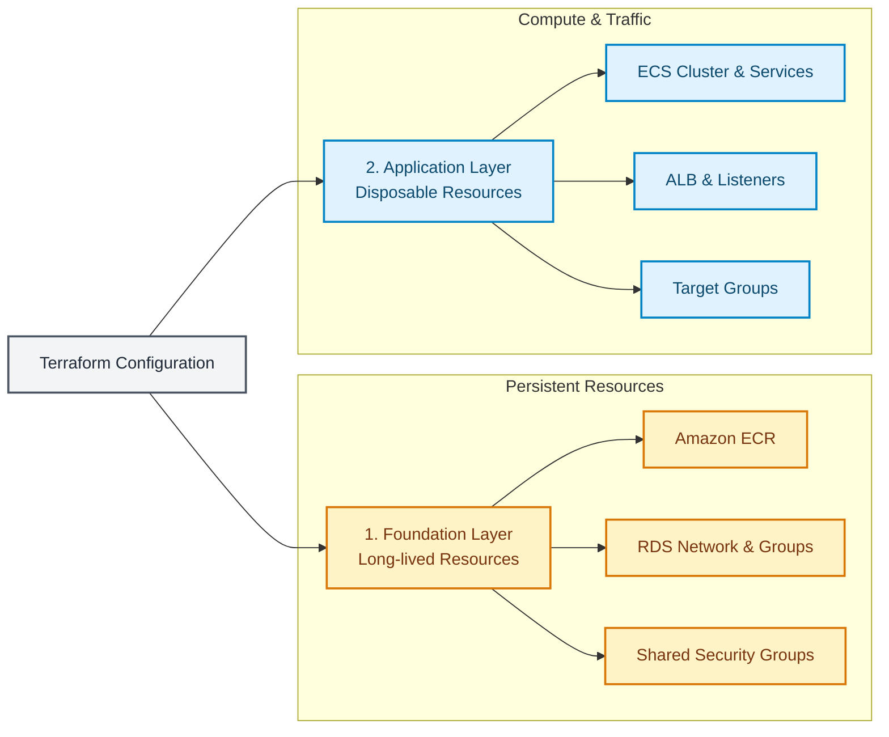

# **Fraud Detection Platform**
An end-to-end machine learning platform for detecting fraudulent online transactions.
The project combines a machine learning pipeline with a production-oriented backend, database, web interface, containerized deployment, CI/CD, and AWS infrastructure managed with Terraform.

## **Features**
* **Machine Learning:** Fraud detection using a LightGBM classification model with custom feature engineering for transaction and identity data, plus validation-based decision threshold optimization.
* **M LOps:** MLflow experiments and model tracking.
* **Backend:** REST API built with FastAPI, JWT-based authentication/authorization, and MySQL database for users and prediction history.
* **Frontend:** Interactive Streamlit frontend.
* **DevOps & CI/CD:** Dockerized applications, automated testing with `pytest`, code quality checks with `Ruff`, and CI/CD via GitHub Actions.
* **Cloud Infrastructure:** AWS deployment using ECS Fargate, AWS RDS for MySQL, Amazon ECR, Application Load Balancer, and infrastructure managed via separate Terraform foundation and application stacks.

# **Technology Stack**
| Area | Technologies |
| :--- | :--- |
| **Machine Learning** | Python, Pandas, NumPy, LightGBM, scikit-learn |
| **Experiment Tracking** | MLflow |
| **Backend** | FastAPI, Pydantic, SQLAlchemy |
| **Authentication** | JWT |
| **Database** | MySQL, AWS RDS, Alembic |
| **Frontend** | Streamlit |
| **Testing** | pytest |
| **Code Quality** | Ruff |
| **Containers** | Docker |
| **CI/CD** | GitHub Actions |
| **Cloud** | AWS ECS Fargate, ECR, RDS, ALB, SSM |
| **Infrastructure as Code** | Terraform |

# **Architecture**
The platform consists of a machine learning model, backend API, database, frontend, and AWS infrastructure managed by Terraform.


# **Terraform Architecture**:


Terraform infrastructure is intentionally separated into two independent states:
### 1. Foundation
Contains long-lived and inexpensive resources that are expected to survive application shutdowns:
* Amazon ECR repositories
* RDS-related resources
* Shared security groups and networking dependencies
## 2. Application
### Contains main resources that can be safely destroyed when the application is not needed
* ECS cluster and services
* ECS task definitions
* Application Load Balancer
* Target groups
* ALB listeners
* Application security groups
This separation allows the application infrastructure to be stopped with:
```bash
cd terraform/application
terraform destroy
```
While persistent resources such as the database and container repositories remain securely available. The application can later be recreated by running:
```bash
cd terraform/application
terraform apply
```
