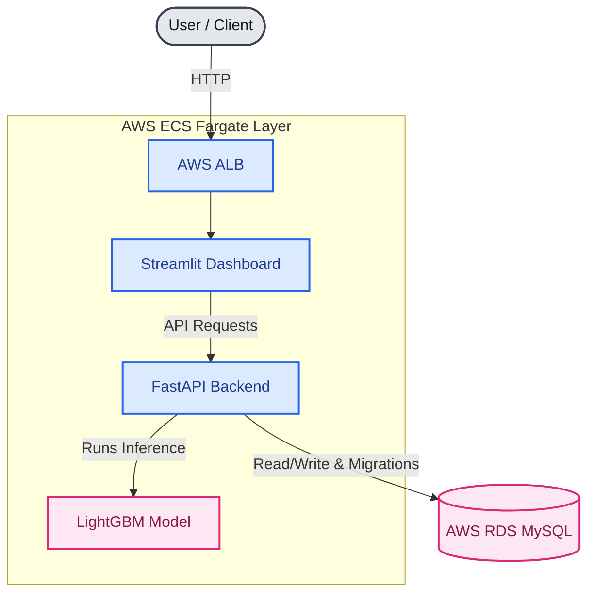
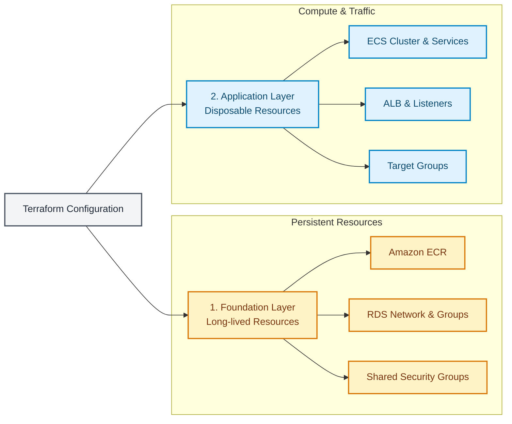

# **Fraud Detection Platform**
An end-to-end machine learning platform for detecting fraudulent online transactions.
The project combines a machine learning pipeline with a production-oriented backend, database, web interface, containerized deployment, CI/CD, and AWS infrastructure managed with Terraform.

## **Features**
* **Machine Learning:** Fraud detection using a LightGBM classification model with custom feature engineering for transaction and identity data, plus validation-based decision threshold optimization.
* **M LOps:** MLflow experiments and model tracking.
* **Backend:** REST API built with FastAPI, JWT-based authentication/authorization, and MySQL database for users and prediction history.
* **Frontend:** Interactive Streamlit frontend.
* **DevOps & CI/CD:** Dockerized applications, automated testing with `pytest`, code quality checks with `Ruff`, and CI/CD via GitHub Actions.
* **Cloud Infrastructure:** AWS deployment using ECS Fargate, AWS RDS for MySQL, Amazon ECR, Application Load Balancer, and infrastructure managed via separate Terraform foundation and application stacks.

# **Technology Stack**
| Area | Technologies |
| :--- | :--- |
| **Machine Learning** | Python, Pandas, NumPy, LightGBM, scikit-learn |
| **Experiment Tracking** | MLflow |
| **Backend** | FastAPI, Pydantic, SQLAlchemy |
| **Authentication** | JWT |
| **Database** | MySQL, AWS RDS, Alembic |
| **Frontend** | Streamlit |
| **Testing** | pytest |
| **Code Quality** | Ruff |
| **Containers** | Docker |
| **CI/CD** | GitHub Actions |
| **Cloud** | AWS ECS Fargate, ECR, RDS, ALB, SSM |
| **Infrastructure as Code** | Terraform |

# **Architecture**
The platform consists of a machine learning model, backend API, database, frontend, and AWS infrastructure managed by Terraform.



# **Terraform Architecture**:


Terraform infrastructure is intentionally separated into two independent states:
### 1. Foundation
Contains long-lived and inexpensive resources that are expected to survive application shutdowns:
* Amazon ECR repositories
* RDS-related resources
* Shared security groups and networking dependencies
## 2. Application
### Contains main resources that can be safely destroyed when the application is not needed
* ECS cluster and services
* ECS task definitions
* Application Load Balancer
* Target groups
* ALB listeners
* Application security groups
This separation allows the application infrastructure to be stopped with:
```bash
cd terraform/application
terraform destroy
```
While persistent resources such as the database and container repositories remain securely available. The application can later be recreated by running:
```bash
cd terraform/application
terraform apply
```
# **Machine Learning**
The fraud detection model is trained on the **IEEE-CIS Fraud Detection** dataset, combining transaction-level and identity information.
# **ML Pipeline**
The machine learning workflow consists of:
1. Data loading and merging of transaction and identity datasets
2. Exploratory data analysis
3. Data preprocessing and missing-value handling
4. Custom feature engineering
5. Temporal train/validation/test splitting
6. Feature selection
7. Creating custom ColumnTransformer
8. Models training (LightGBM, XGBoost, and CatBoost)
9. Champion model selection (LightGBM)
10. Hyperparameter tuning
11. Validation-based decision threshold optimization
12. Final model training on the combined training and validation data
13. Evaluation on a separate temporal test set
14. Model logging and tracking with MLflow
A temporal split is used instead of a random split to better reflect a real fraud detection scenario, where a model is trained on historical transactions and evaluated on future transactions.

# **Model**
The final classifier is based on LightGBM, a gradient boosting framework well suited for tabular data.

Because fraud detection is an imbalanced classification problem, model evaluation focuses on metrics beyond accuracy, particularly PR-AUC, ROC-AUC, precision, recall, and F1-score.

The prediction threshold is optimized on the validation set instead of relying exclusively on the default 0.5 threshold. This allows the system to balance precision and recall according to the requirements of fraud detection.
# Validation Performance
| **Metric** | | **Validation** |
| :---| :---|
| **PR-AUC** | ~0.412 |
| **ROC-AUC** | ~0.893 |
| **Precision** | ~0.451 |
| **Recall** | ~0.425 |
| **F1-score** | ~0.438 |
The optimized classification threshold was 0.18.
## Test Performance
The final model was retrained using the training and validation data and evaluated on the held-out temporal test set.
| **Metric**  | **Validation** |
| :---| :--- |
| **PR-AUC** | ~0.345 |
| **ROC-AUC** | ~0.866 |
The difference between validation and test performance reflects the difficulty of generalizing fraud detection models to later, previously unseen transactions.

